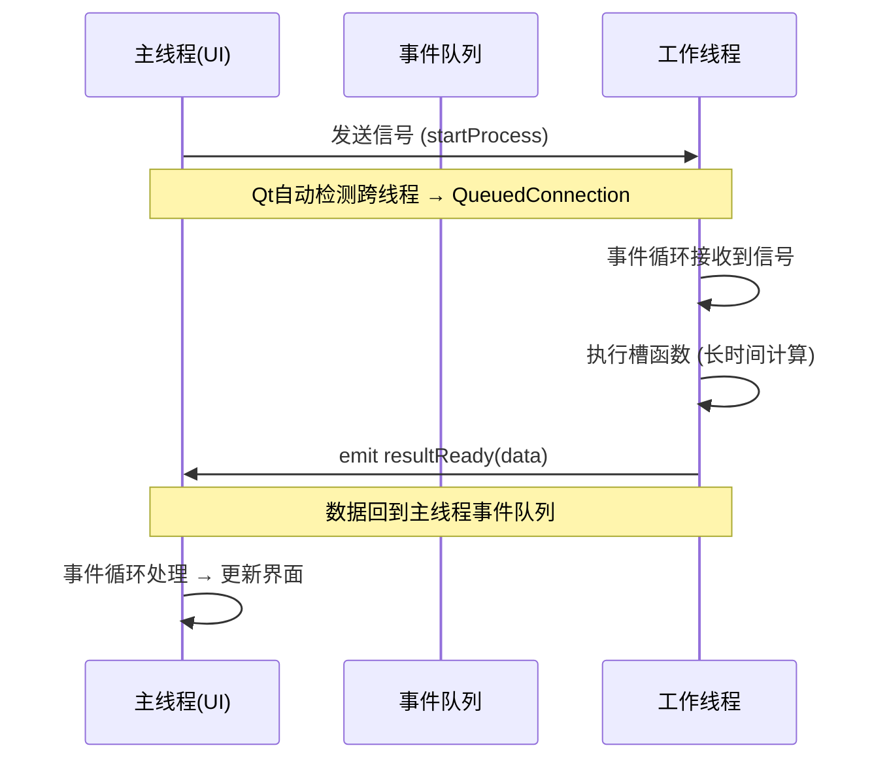

# Qt多线程编程：QThread与线程池的工程实战

> 作者：蔡浩宇 | Qt/C++开发笔记

## 引言

GUI应用程序有一个铁律：**主线程不能被阻塞**。当界面线程卡在耗时操作上超过几百毫秒，用户就会看到"无响应"的窗口——这是任何桌面软件都无法接受的体验。在上一篇Model/View架构的文章中我们提到，数据刷新必须异步执行；而在串口调试助手的开发中，我们也遇到了接收线程与界面解耦的需求。本文将系统梳理Qt中三种核心多线程方案——QThread、QThreadPool与QtConcurrent——并给出经过验证的工程范式。

---

## 1. 为什么不用std::thread？

在进入Qt线程之前，需要先回答一个自然问题：既然C++11已经提供了std::thread，为什么还需要QThread？

| 维度 | std::thread | QThread |
|------|-----------|---------|
| 信号槽支持 | 需手动桥接 | 原生支持跨线程信号槽 |
| 事件循环 | 无 | 内置QEventLoop |
| 优雅退出 | 需自行设计 | quit() + wait() 标准模式 |
| 优先级控制 | 平台API | QThread::Priority 封装 |
| 与Qt对象集成 | 需注意线程亲和性 | 完整配合QObject |

**核心差异**：QThread不只是线程封装，它是一个带事件循环的线程——这使它天然适配异步通信模型。

---

## 2. QThread的两种正确用法

### 2.1 继承QThread（旧式，不推荐）

```cpp
class WorkerThread : public QThread {
    Q_OBJECT
protected:
    void run() override {
        // 工作代码写在这里
        for (int i = 0; i < 100; i++) {
            emit progressChanged(i);
            msleep(50);
        }
    }
signals:
    void progressChanged(int value);
};

// 使用
auto *worker = new WorkerThread;
connect(worker, &WorkerThread::progressChanged,
        this, &MyWidget::onProgress);
worker->start();  // 启动新线程执行run()
```

**为什么不推荐**：run()内部创建的对象依附于新线程，但Worker对象本身仍在创建线程中。这种线程亲和性割裂容易导致信号槽连接混乱。

### 2.2 moveToThread（推荐范式）

```cpp
class DataProcessor : public QObject {
    Q_OBJECT
public slots:
    void process(const QByteArray &rawData) {
        // 耗时数据处理
        auto result = heavyComputation(rawData);
        emit dataReady(result);
    }
signals:
    void dataReady(const QVariant &result);
};

// 使用
auto *worker = new QThread;
auto *processor = new DataProcessor;
processor->moveToThread(worker);          // ← 关键：移动线程亲和性

connect(worker,  &QThread::finished,
        processor, &QObject::deleteLater);
connect(this,    &MainWindow::rawDataReceived,
        processor, &DataProcessor::process);   // 跨线程信号槽
connect(processor, &DataProcessor::dataReady,
        this,     &MainWindow::onDataReady);

worker->start();
```

**为什么推荐**：线程与工作对象完全解耦。QObject及其所有子对象都明确依附于工作线程，避免了线程亲和性的歧义。

---

## 3. 信号槽的跨线程机制

### 3.1 连接类型一览

```cpp
// 当 sender 和 receiver 在不同线程时，默认行为是 Qt::QueuedConnection
connect(sender, &Sender::signal,
        receiver, &Receiver::slot,
        Qt::AutoConnection);  // 自动选择
```

| 连接类型 | 槽执行线程 | 调用方式 | 适用场景 |
|---------|----------|---------|---------|
| `DirectConnection` | 信号所在线程 | 同步调用 | 同线程，无需队列 |
| `QueuedConnection` | 接收者线程 | 事件队列 | **跨线程通信的标准选择** |
| `BlockingQueuedConnection` | 接收者线程 | 同步等待 | 需要返回值时（慎用） |
| `AutoConnection` | 自动判断 | 同线程direct，跨线程queued | 默认行为 |



### 3.2 常见陷阱：对象生命周期

```cpp
// ❌ 错误：lambda中捕获了可能已销毁的对象
connect(worker, &QThread::finished, [this]() {
    m_label->setText("Done");  // m_label 可能已被销毁
});

// ✅ 正确：通过接收者对象自动管理连接
connect(worker, &QThread::finished,
        m_label, [this]() { m_label->setText("Done"); });
// 当 m_label 被销毁时，连接自动断开
```

---

## 4. QThreadPool与QRunnable

对于"启动-执行-完成"模式的短期任务，每次都创建/销毁QThread开销太大。线程池通过复用线程消除了这一开销。

### 4.1 基础用法

```cpp
class ComputeTask : public QRunnable {
public:
    ComputeTask(const QString &input) : m_input(input) {
        setAutoDelete(true);  // 执行完成后自动销毁
    }
protected:
    void run() override {
        auto result = performHeavyComputation(m_input);
        // 但这里无法直接emit信号！QRunnable不是QObject
    }
private:
    QString m_input;
};

// 执行
QThreadPool::globalInstance()->start(new ComputeTask("data.txt"));
```

### 4.2 线程池配置

```cpp
QThreadPool *pool = QThreadPool::globalInstance();

// 获取最优线程数
int idealCount = QThread::idealThreadCount();  // 通常 = CPU核心数
qDebug() << "Ideal threads:" << idealCount;

// 控制并发
pool->setMaxThreadCount(idealCount);  // 限制最大并发数
pool->setExpiryTimeout(30000);        // 空闲线程30秒后回收
```

### 4.3 解决QRunnable无法发信号的痛点

```cpp
// 方案：组合 QRunnable + QObject 信号代理
class AsyncTask : public QObject, public QRunnable {
    Q_OBJECT
public:
    explicit AsyncTask(const QString &input, QObject *parent = nullptr)
        : QObject(parent), m_input(input) {
        setAutoDelete(true);
    }
protected:
    void run() override {
        auto result = performHeavyComputation(m_input);
        emit finished(result);  // 现在可以发信号了！
    }
signals:
    void finished(const QVariant &result);
private:
    QString m_input;
};

// 使用
auto *task = new AsyncTask("data.csv");
task->setAutoDelete(false);  // 需要手动管理，因为QObject不能autoDelete
connect(task, &AsyncTask::finished, this, &MainWindow::onResult);
QThreadPool::globalInstance()->start(task);
```

---

## 5. QtConcurrent：声明式并发

对于"map/filter/reduce"模式的数据并行处理，QtConcurrent提供了最简洁的API。

### 5.1 QtConcurrent::run

```cpp
// 异步执行一个函数，返回QFuture
QFuture<QImage> future = QtConcurrent::run([this]() {
    return generateThumbnail(m_largeImage, 256, 256);
});

// 通过QFutureWatcher监控进度
auto *watcher = new QFutureWatcher<QImage>(this);
connect(watcher, &QFutureWatcher<QImage>::finished, [watcher]() {
    QImage thumb = watcher->result();
    // 显示缩略图
});
watcher->setFuture(future);
```

### 5.2 实际场景：批量图像处理

```cpp
// 对100张图片并发生成缩略图
QStringList files = getImageFiles("D:/photos/");

QFuture<QImage> future = QtConcurrent::mapped(files, [](const QString &path) {
    QImage img(path);
    return img.scaled(256, 256, Qt::KeepAspectRatio, Qt::SmoothTransformation);
});

auto *watcher = new QFutureWatcher<QImage>(this);
connect(watcher, &QFutureWatcher<QImage>::progressValueChanged,
        m_progressBar, &QProgressBar::setValue);
connect(watcher, &QFutureWatcher<QImage>::resultReadyAt,
        this, [this](int index) {
    // 每完成一张就显示
    // watcher->resultAt(index)
});
watcher->setFuture(future);
```

---

## 6. 实战：串口数据采集的多线程架构

回顾上一篇串口调试助手的设计，我们用最朴素的方式处理了串口数据。现在，让我们用线程池将其升级为工业级数据采集架构：

```
┌──────────────────────────────────────────────────────────────┐
│                      MainWindow (主线程)                       │
│  ┌─────────┐  ┌──────────┐  ┌──────────────┐               │
│  │ 串口配置 │  │ 实时波形  │  │ 数据表格视图  │               │
│  └─────────┘  └──────────┘  └──────────────┘               │
│       │              ▲              ▲                        │
│       │              │              │                        │
│    start/stop   信号更新      信号更新                         │
└───────┼──────────────┼──────────────┼────────────────────────┘
        │              │              │
        ▼              │              │
┌───────────────────┐  │              │
│ SerialReader      │  │              │
│ (QThread 独立线程) │  │              │
│                   │──┤              │
│ • 阻塞读取串口     │  │              │
│ • 帧解析          │ emit rawData   │
│ • 超时检测        │  │              │
└───────────────────┘  │              │
        │              ▼              │
        │    ┌─────────────────────┐  │
        └───►│ QThreadPool         │  │
             │  ├─ ParserTask      │──┤
             │  │  (帧解析→结构化)  │  │
             │  ├─ ComputeTask     │──┤
             │  │  (数值计算/统计)  │  │
             │  └─ LogTask         │  │
             │    (异步写SD卡)     │  │
             └─────────────────────┘  │
```

```cpp
// SerialReader: 独占一个QThread
class SerialReader : public QObject {
    Q_OBJECT
public:
    SerialReader(QSerialPort *port) : m_port(port) {}
public slots:
    void start() {
        while (m_running) {
            if (m_port->waitForReadyRead(100)) {
                QByteArray data = m_port->readAll();
                m_buffer.append(data);
                // 帧解析
                while (extractFrame()) {
                    emit frameReceived(m_frame);
                }
            }
        }
    }
signals:
    void frameReceived(const QByteArray &frame);
private:
    QSerialPort *m_port;
    QByteArray m_buffer, m_frame;
    bool m_running = true;
};

// FrameParser: 通过线程池并发处理每帧数据
class FrameParserTask : public QObject, public QRunnable {
    Q_OBJECT
public:
    FrameParserTask(const QByteArray &frame) : m_frame(frame) {}
protected:
    void run() override {
        SensorData data = parse(m_frame);
        emit parsed(data);
    }
signals:
    void parsed(const SensorData &data);
};

// 主窗口中的连接
void MainWindow::initAcquisition() {
    // 串口读取线程
    m_serialThread = new QThread(this);
    m_reader = new SerialReader(m_port);
    m_reader->moveToThread(m_serialThread);

    // 帧数据 → 线程池并行解析
    connect(m_reader, &SerialReader::frameReceived,
            this, [this](const QByteArray &frame) {
        auto *task = new FrameParserTask(frame);
        connect(task, &FrameParserTask::parsed,
                this, &MainWindow::onSensorData);
        QThreadPool::globalInstance()->start(task);
    });

    // 避免线程池无限排队
    QThreadPool::globalInstance()->setMaxThreadCount(4);

    connect(m_serialThread, &QThread::started,
            m_reader, &SerialReader::start);
    m_serialThread->start();
}
```

**架构要点**：
- 串口读取独占线程，保证数据不丢失
- 帧解析在线程池中并行，充分利用多核
- 所有界面更新通过QueuedConnection回到主线程
- 线程数限制为4，避免过度并发

---

## 7. 常见陷阱与最佳实践

### 7.1 不要在子线程中操作GUI

```cpp
// ❌ 崩溃/未定义行为
void Worker::run() {
    m_label->setText("Done");  // QWidget只能由主线程操作
}

// ✅ 通过信号回到主线程
void Worker::run() {
    emit workFinished("Done");
}
```

### 7.2 线程安全的数据共享

```cpp
class SharedBuffer {
    QMutex m_mutex;
    QList<DataPoint> m_data;

public:
    void append(const DataPoint &dp) {
        QMutexLocker locker(&m_mutex);
        m_data.append(dp);
    }

    QList<DataPoint> takeAll() {
        QMutexLocker locker(&m_mutex);
        return m_data;  // 隐式共享，安全
    }
};
```

### 7.3 优雅退出

```cpp
class Worker : public QObject {
    Q_OBJECT
public slots:
    void doWork() {
        while (!QThread::currentThread()->isInterruptionRequested()) {
            // 做工作...
            QThread::currentThread()->msleep(100);
        }
    }
};

// 在主线程停止工作
void MainWindow::stopWorker() {
    m_workerThread->requestInterruption();
    m_workerThread->quit();
    m_workerThread->wait(5000);  // 最多等5秒
}
```

---

## 8. 方案选型决策树

```
需要多线程吗？
├─ 短期任务，频繁创建？ → QThreadPool + QRunnable
│   └─ 需要发信号？ → 组合QObject + QRunnable
├─ 长期运行的后台服务？ → QThread + moveToThread
├─ 数据并行处理？ → QtConcurrent::mapped/reduce
├─ 单次异步调用？ → QtConcurrent::run
└─ 极度简单的场景？ → QThread::create() 便捷函数 (Qt 5.10+)
```

| 方案 | 适用场景 | 线程管理 | 信号槽支持 |
|------|---------|---------|-----------|
| QThread + moveToThread | 持久后台任务 | 手动 | ✅ 完善 |
| QThreadPool | 大量短期任务 | 自动 | 需组合QObject |
| QtConcurrent | 并行数据处理 | 自动 | 通过QFutureWatcher |
| QThread::create() | 一次性任务 | 自动 | 有限 |

---

## 结语

Qt的多线程体系提供了一个层次分明的工具箱：QThread解决"谁来做"的问题，线程池解决"如何高效管理"的问题，QtConcurrent解决"如何优雅表达"的问题。掌握它们不是终点——真正的考验在于设计出数据流清晰、无竞态条件、并且能在6个月后依然被同事看懂的线程架构。

下一篇预告：我们将在Qt自定义绘制系统中深入探讨QPainter的坐标变换、离屏渲染与实时波形绘制——这是可视化仪表盘开发的必经之路。

---

*本文基于Qt 5.15，大部分API兼容Qt 6.x。完整可编译示例代码见配套GitHub仓库。*
